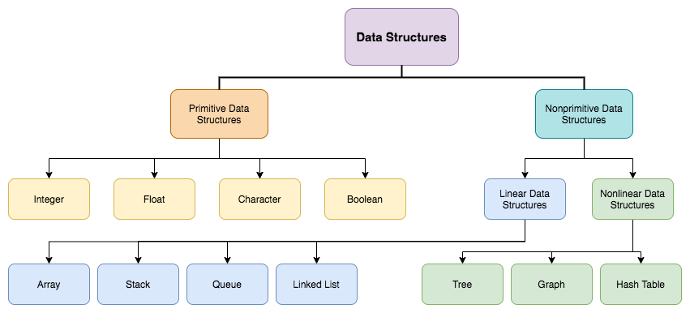
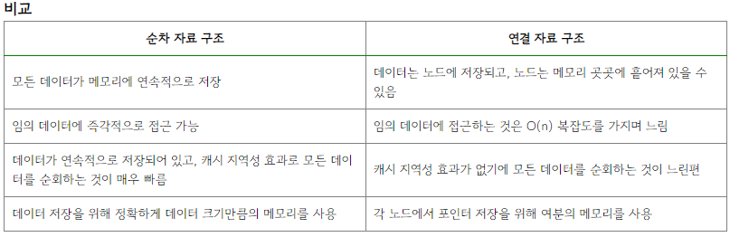

# 1주차 : 자료구조에 대한 이해 및 알고리즘의 분석
## 자료구조에 대한 이해
### 자료구조란 무엇인가?
**현실에 있는 데이터를 표현하는 방법**  
**큰 데이터를 효율적으로 관리하는 방법**  
=> 프로그램은 각종 데이터를 인간보다 효율적으로 처리하는 것이 주 목적을 가지고 있다.   
>여기서 데이터를 처리함에 있어 컴퓨터 내부에 표현하는 방법이 성능에 큰 영향을 주게 된다.  
자료구조는 복합적인 형태의 데이터를 저장 및 유지, 추출하는 방식이 구현된 형태이고,  
각 자료구조들은 데이터의 저장과 추출 방법의 차이로 분류된다.

### 자료구조의 종류

---
 

구글 블로그를 탐험하다 가져온 자료구조의 하나의 종류이다.//이것도 트리구조?

천천히 하나씩 들어가보자 디게 많긴 하다
 
 
## Primitive Data Structure
>한 가지 유형의 데이터만 저장하는 데이터 구조의 기본 유형  
ex) 정수, 실수, 문자, 포인터 등의 자료의 형태

>### **자스적 시선**  
>자바스크립트에서의 기본 자료형(Primitive types)  
* Number  
* String   
* Boolean  
* null  
* undefined  
* symbol  

## Non-Primitive Data Structure
다른 유형의 데이터를 단일 엔티티에 저장하는 사용자 정의 데이터 구조 유형
  
###  1. 선형 자료구조
  
>데이터가 순차적으로 저장된다는 특징을 지님  
한 칸에 하나의 데이터만 들어가고 그 데이터들이 연속적으로 연결된 형태의 자료구조  
자료 간의 연결 관계가 1:1 관계를 가지는 형태  

대표적예시 // 다음주 구현 예정  
* 배열   
* 연결리스트  
* 스택  
* 큐  
 
### 2.비선형 자료구조

>데이터가 비순차적으로 저장된다는 특징을 지님  
자료 간의 연결 관계가 1:n or n:n 관계를 가지는 형태의 자료구조  

대표적 예시 // 다음주 구현 예정  
* 트리  
* 그래프
  
## 자료구조의 구현 방법
* 자료구조를 구현하는 방법은 크게 2가지가 있다.  

>### 순차자료구조 : 데이터가 논리적 순서에 근거하여 연속된 메모리에 저장된 형태의 자료구조 구현방식  

>### 연결자료구조 : 데이터는 노드에 저장, 각 노드는 메모리에 랜덤하게 저장되어 있으며, 해당 노드를 포인터를 통해 상호 연결하는 방식의 자료구조 구현방식
  

>예를 들어, 자료구조를 무작정 구현하는 것이 아닌 데이터가 논리적인 순서, index를 가져야하는 경우에는 순차자료구조를 생각하며 구현하는 것이 유리하다.

  

캐시지역성이란?  
* 캐시가 효율적으로 동작하려면, 캐시의 적중률을 극대화 시켜야한다.
* 캐시에 저장할 데이터가 지역성을 가져야한다
* 지역성이란 데이터 접근이 시간적, 혹은 공간적으로 가깝게 일어나는 것을 의미
* 지역성의 전제 조건 : 프로그램은 모든 코드나 데이터를 균등하게 접근하지 않는다
* 지역성이란
* 기억장치 내의 코드를 균일하게 접근하는 것이 아닌 어느 한 순간에 특정 부분을 집중적으로 참조하는 특성이다
* **CPU가 기억장치의 특정 부분에 위치한 데이터나 코드를 집중적으로 액세스하는 현상** 
