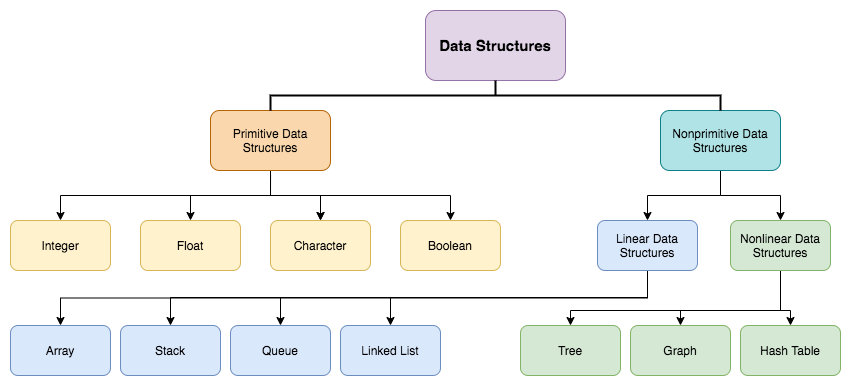

# 1주차 : 자료구조에 대한 이해 및 알고리즘의 분석
## 자료구조에 대한 이해
### 자료구조란 무엇인가?
**현실에 있는 데이터를 표현하는 방법**  
**큰 데이터를 효율적으로 관리하는 방법**  
=> 프로그램은 각종 데이터를 인간보다 효율적으로 처리하는 것이 주 목적을 가지고 있다.   
>여기서 데이터를 처리함에 있어 컴퓨터 내부에 표현하는 방법이 성능에 큰 영향을 주게 된다.  
자료구조는 복합적인 형태의 데이터를 저장 및 유지, 추출하는 방식이 구현된 형태이고,  
각 자료구조들은 데이터의 저장과 추출 방법의 차이로 분류된다.

### 자료구조의 종류

---
 

구글 블로그를 탐험하다 가져온 자료구조의 하나의 종류이다.//이것도 트리구조?

천천히 하나씩 들어가보자 디게 많긴 하다
 
 
## Primitive Data Structure
>한 가지 유형의 데이터만 저장하는 데이터 구조의 기본 유형  
ex) 정수, 실수, 문자, 포인터 등의 자료의 형태

>### **자스적 시선**  
>자바스크립트에서의 기본 자료형(Primitive types)  
* Number  
* String   
* Boolean  
* null  
* undefined  
* symbol  

## Non-Primitive Data Structure
다른 유형의 데이터를 단일 엔티티에 저장하는 사용자 정의 데이터 구조 유형
  
###  1. 선형 자료구조
  
>데이터가 순차적으로 저장된다는 특징을 지님  
한 칸에 하나의 데이터만 들어가고 그 데이터들이 연속적으로 연결된 형태의 자료구조  
자료 간의 연결 관계가 1:1 관계를 가지는 형태  

대표적예시 // 다음주 구현 예정  
* 배열   
* 연결리스트  
* 스택  
* 큐  
 
### 2.비선형 자료구조

>데이터가 비순차적으로 저장된다는 특징을 지님  
자료 간의 연결 관계가 1:n or n:n 관계를 가지는 형태의 자료구조  

대표적 예시 // 다음주 구현 예정  
* 트리  
* 그래프
  
## 자료구조의 구현 방법
* 자료구조를 구현하는 방법은 크게 2가지가 있다.  

>### 순차자료구조 : 데이터가 논리적 순서에 근거하여 연속된 메모리에 저장된 형태의 자료구조 구현방식  

>### 연결자료구조 : 데이터는 노드에 저장, 각 노드는 메모리에 랜덤하게 저장되어 있으며, 해당 노드를 포인터를 통해 상호 연결하는 방식의 자료구조 구현방식
  

>예를 들어, 자료구조를 무작정 구현하는 것이 아닌 데이터가 논리적인 순서, index를 가져야하는 경우에는 순차자료구조를 생각하며 구현하는 것이 유리하다.

  

캐시지역성이란?  
* 캐시가 효율적으로 동작하려면, 캐시의 적중률을 극대화 시켜야한다.
* 캐시에 저장할 데이터가 지역성을 가져야한다
* 지역성이란 데이터 접근이 시간적, 혹은 공간적으로 가깝게 일어나는 것을 의미
* 지역성의 전제 조건 : 프로그램은 모든 코드나 데이터를 균등하게 접근하지 않는다
* 지역성이란
* 기억장치 내의 코드를 균일하게 접근하는 것이 아닌 어느 한 순간에 특정 부분을 집중적으로 참조하는 특성이다
* **CPU가 기억장치의 특정 부분에 위치한 데이터나 코드를 집중적으로 액세스하는 현상** 

## 알고리즘의 분석
>알고리즘을 분석한다는 것은 무엇인가?  
해당 알고리즘의 성능을 분석한다는 의미  
=> 알고리즘의 성능을 좌우하는 것은 수행시간과 사용하는 메모리  

 

===> 알고리즘을 수행하는 환경에 따라 수행시간이 달라지는 변수들이 존재하기 때문에 이에 대한 객관적인 지표를 분석할 필요가 있다. 이러한 객관적인 분석 방법이 시간복잡도와 공간복잡도가 있다.
 

### 시간 복잡도
해당 알고리즘을 수행하는데 필요한 연산이 총 몇번 실행되는지를 숫자로 표기한 것이다.
알고리즘 연산횟수의 총량
이 연산은 입력한 데이터 ‘N’에 따라 변화한다
N에 따라 변화하는 시간복잡도를 나타낸 것을 시간 복잡도 함수라고 한다.

 

### 공간 복잡도
해당 알고리즘을 수행하는데 필요한 메모리의 용량을 숫자로 표기한 것이다.
알고리즘 연산에 대한 메모리의 총량
공간 복잡도의 함수는 고정공간 +가변공간으로 표현가능하다.

 

### Big-O 표기법
알고리즘의 효율성을 평가하기위한 분석법
시간복잡도와 공간복잡도에서의 N의 증가에 대한 알고리즘의 효율성을 평가하기 위한 그래프(단순한 알고리즘 성능 비교가 아님!)

 

만약 시간복잡도함수를 예를 들어, T(n)=n^2 + 1의 경우 n=1000인 경우 +1의 상수항의 영향이 미비하기에 이를 생략한다. (계수 법칙 : 오로지 n과 관련된 수만 생각함)
 

* O(1) : 배열의 n번째 원소 접근, 스택에 push/pop
* O(log n) : 이진탐색
* O(n) : 배열에서 검색, 최솟값 최댓값 탐색
* O(n log n) : 병합 정렬, 힙 정렬
* O(n^2) : 버블정렬, 선택정렬, 삽입 정렬, 이중 for문
* O(2n) :  피보나치 수열

⇒알고리즘의 성능을 파악하는 것은 컴퓨터에서 사용하는 자원을 얼마나 소비하는지가 중요.
여기서 자원은 알고리즘의 수행시간과 메모리.
해당 알고리즘의 수행횟수를 시간복잡도라하고 이에 대한 함수를 시간복잡도 함수라고 한다.
여기서 메모리의 경우는 공간복잡도와 이에 대한 함수는 공간복잡도 함수라고 한다.

그리고 알고리즘의 효율성을 비교하기 위해 빅오 표기법을 통해 비교한다.
빅오 표기법은 데이터 입력 N에 대해 입력의 증가에 대한 효율성을 검증할 때 이용한다.

